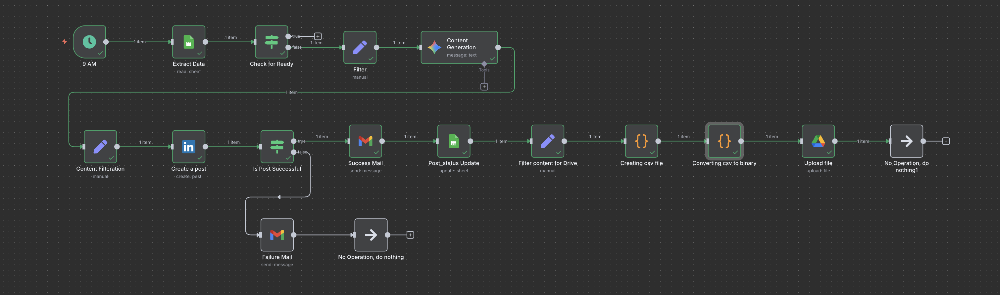

# 🤖 LinkedIn Post Automation with n8n

This project automates the process of posting to **LinkedIn** using [n8n](https://n8n.io/), while also tracking posts in **Google Sheets**, generating CSV reports, uploading them to **Google Drive**, and sending email notifications on success or failure.

---

## 📌 What This Project Does

This automation reads post descriptions from a Google Sheet and goes through the following steps:

1. 🔄 **Reads unposted content** from Google Sheets.
2. 🤖 **Uses Gemini-2.5-flash model** to generate detailed LinkedIn post content based on the short description.
3. 📤 **Posts the content to LinkedIn** via LinkedIn API.
4. ✅ **Updates the post status** in Google Sheets as "Posted".
5. 📧 **Sends a success or failure email** notification after each attempt.
6. 📄 **Generates a structured `.csv` report** containing the post description, URN, and timestamp.
7. ☁️ **Uploads that report to Google Drive** as a binary file.

> This is ideal for marketing teams, personal brand builders, or agencies who want to semi-automate their content distribution via LinkedIn.

---

## ✨ Features

- Read & filter posts from Google Sheets
- AI content generation based on short description
- LinkedIn post publishing
- Real-time post status updates
- Success & failure email alerts
- Structured `.csv` reporting
- Google Drive integration for report storage
- Error handling with conditional logic
- Fully modular & reusable workflow

---

## 📸 Workflow Overview



---

## ⚙️ Requirements

Before running this workflow, ensure you have the following:

### 🔐 Credentials Needed
- **Google Sheets** (OAuth2 or service account)
- **Google Drive** access
- **LinkedIn Developer Account**
  - With access token and proper API permissions
- **Email SMTP** credentials
- (Optional) **OpenAI / Claude / Gemini API Key** for AI content generation

---

## 🚀 How to Use This Project

🧩 Step 1: Clone the Repository
```bash
git clone https://github.com/tanishra/Linkedin-Post_Automation.git
cd n8n-linkedin-automation
```

🧩 Step 2: Import the Workflow into n8n
- Open your n8n instance
- Click Import using file
- Upload workflow/Linkedin_Post_Automation.json

🧩 Step 3: Configure Credentials
- Set up these credentials in n8n:
- Google Sheets
- Google Drive
- LinkedIn API
- Email (SMTP or OAuth2)
- AI Provider (if applicable)

🧩 Step 4: Customize Google Sheet
- Prepare your sheet with at least these columns:
Post Description	URLs        Post Status

🧩 Step 5: Run the Workflow
You can:
- Run it manually from the editor
- Or set it on a schedule trigger to run daily

--- 

## ❌ Error Handling
- If a post **fails** (e.g. invalid token, expired credentials, network error), the workflow will:
  - Send a **failure email** to your configured email address
  - **Do not** update the `post_status` in Google Sheets

- If the post is **successful**, the workflow will:
  - Update the `post_status` in the sheet to `"Posted"`
  - Generate a `.csv` report and upload it to Google Drive

---

## 🛠 LinkedIn Setup Guide (API Credentials)

To allow n8n to post to LinkedIn on your behalf, you need to create a LinkedIn Developer App and configure authentication.

### ✅ Step 1: Create a LinkedIn Page (If You Don’t Have One)

1. Go to [LinkedIn Pages](https://www.linkedin.com/company/setup/new/)
2. Choose a type (e.g., Small business or Community page)
3. Fill in the required fields like:
   - Page name
   - Website
   - Industry
   - Logo and tagline
4. Click **Create Page**

> You must be an **admin of the page** to post via the API.

---

### ✅ Step 2: Create a LinkedIn Developer App

1. Go to [LinkedIn Developers Portal](https://www.linkedin.com/developers/)
2. Click **Create App**
3. Fill in:
   - App name
   - LinkedIn page you created
   - Business email
   - App logo (optional)
4. Agree to terms and click **Create App**

---

### ✅ Step 3: Configure Auth & Permissions

1. Go to your app settings
2. Under **"Auth"**, you’ll find:
   - **Client ID**
   - **Client Secret**
3. Copy both — you’ll need them for n8n

> You’ll use these in an **OAuth2 credential** in n8n.

4. Add **Redirect URL**:  
   For local n8n: `http://localhost:5678/rest/oauth2-credential/callback`

---

### ✅ Step 4: Add Required OAuth Scopes

Go to the **"Products"** tab and request access to:

- **Sign In with LinkedIn**
- **Share on LinkedIn**

After approval:

- Add these scopes in your credential config in n8n:
  - `r_liteprofile`
  - `w_member_social`

---

### ✅ Step 5: Configure LinkedIn OAuth2 in n8n

1. Go to **n8n → Credentials → Create New**
2. Select **OAuth2 API**
3. Fill in:
   - **Auth URL**: `https://www.linkedin.com/oauth/v2/authorization`
   - **Access Token URL**: `https://www.linkedin.com/oauth/v2/accessToken`
   - **Client ID**: (from your app)
   - **Client Secret**: (from your app)
   - **Scope**: `r_liteprofile  w_member_social`
   - **Token Type**: `Bearer`
   - **Redirect URI**: as provided by n8n
4. Save and **click "Connect"** to authorize

---

> 🔐 Once connected, you can use this credential in your LinkedIn node to post content.


--- 

## 🙌 Contributing
Contributions are welcome! Here's how:
- Fork the repo
- Create a feature branch
- Make your changes
- Submit a PR with a clear description
	
